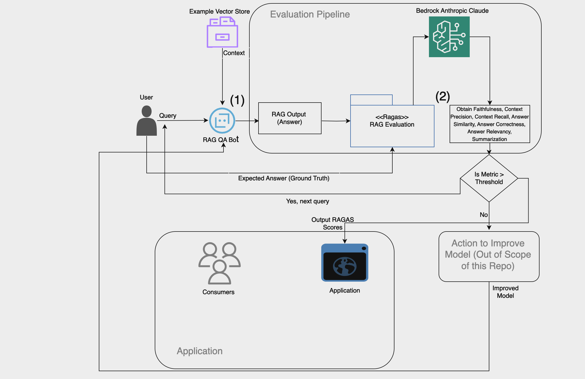

<h1 align="center">
  
</h1>
<p align="center">
  <i>Evaluation framework for your Retrieval Augmented Generation (RAG) Pipelines Using Bedrock</i>
</p>

<p align="center">
    <a href="https://github.com/explodinggradients/ragas/releases">
        
    </a>
    <a href="https://www.python.org/">
            
    </a>
    <a href="https://github.com/explodinggradients/ragas/blob/master/LICENSE">
        
    </a>
    <a href="https://colab.research.google.com/github/explodinggradients/ragas/blob/main/docs/quickstart.ipynb">
        
    </a>
    <a href="https://discord.gg/5djav8GGNZ">
        
    </a>
    <a href="https://github.com/explodinggradients/ragas/">
        
    </a>
</p>

<h4 align="center">
    <p>
        <a href="https://docs.ragas.io/">Documentation</a> |
        <a href="#shield-installation">Installation</a> |
        <a href="#fire-quickstart">Quickstart</a> |
        <a href="#-community">Community</a> |
        <a href="#-open-analytics">Open Analytics</a> |
        <a href="https://huggingface.co/explodinggradients">Hugging Face</a>
    <p>
</h4>

> 🚀 Dedicated solutions to evaluate, monitor and improve performance of LLM & RAG application in production including custom models for production quality monitoring.[Talk to founders](https://calendly.com/shahules/30min)

Ragas is a framework that helps you evaluate your Retrieval Augmented Generation (RAG) pipelines. RAG denotes a class of LLM applications that use external data to augment the LLM’s context. There are existing tools and frameworks that help you build these pipelines but evaluating it and quantifying your pipeline performance can be hard. This is where Ragas (RAG Assessment) comes in.

Ragas provides you with the tools based on the latest research for evaluating LLM-generated text to give you insights about your RAG pipeline. Ragas can be integrated with your CI/CD to provide continuous checks to ensure performance.

## Table of Contents
- [Architecture](#overview)
- [Prerequisites and Setup](#prerequisites-and-setup)
- [Usage and Examples](#usage-and-examples)
- [Project Status](#project-status)
- [Team](#team)

## Architecture
Below is a sample architecture for RAG evaluation. The RAGAS package for AWS projects will require the use of Bedrock. 



This diagram showcases: 

1. RAG QA bot being used to answer a user query

2. The user providing ground truth for each of the queries

3. Obtaining scores for specified metrics using Ragas

4. Providing some sort of Error Correcting mechanism to improve the model based on the metrics. This is out of scope of this repository. 

5. Displaying Ragas outputs to some sort of application based on your use case. For example, you may want to use this as confidence that an LLM has outputted relevant and correct outputs. 

## :shield: Prerequisites and Setup

```bash
pip install ragas
```

if you want to install from source

```bash
git clone https://github.com/explodinggradients/ragas && cd ragas
pip install -e .
```

## :fire: Usage and Examples

This is a small example program you can run to see ragas in action!

```python

import sys
sys.path.insert(0, '[path-to-ragas-folder]/src')

from datasets import Dataset 
import os
from ragas import evaluate
from ragas.metrics import faithfulness, answer_correctness, context_precision, answer_similarity, [add any other metrics of interest]
from langchain_aws.chat_models import ChatBedrock
from langchain_community.embeddings import BedrockEmbeddings

config = {
    "region_name": "{add region name}",  # E.g. "us-east-1"
    "model_id": 'anthropic.claude-3-haiku-20240307-v1:0',  # E.g "anthropic.claude-v2" 
    "model_kwargs": {"temperature": 0.4, "max_tokens": 5000}, # change max tokens if required
}
bedrock_model = ChatBedrock(
    region_name=config["region_name"],
    endpoint_url=f"https://bedrock-runtime.{config['region_name']}.amazonaws.com",
    model_id=config["model_id"],
    model_kwargs=config["model_kwargs"],
)

# init the embeddings, make sure you have access to the model
bedrock_embeddings = BedrockEmbeddings(
    model_id='amazon.titan-embed-text-v1,
    region_name=config["region_name"],
)

data_samples = {
    'question': ['When was the first super bowl?', 'Who won the most super bowls?'],
    'answer': ['The first superbowl was held on Jan 15, 1967', 'The most super bowls have been won by The New England Patriots'],
    'contexts' : [['The First AFL–NFL World Championship Game was an American football game played on January 15, 1967, at the Los Angeles Memorial Coliseum in Los Angeles,'], 
    ['The Green Bay Packers...Green Bay, Wisconsin.','The Packers compete...Football Conference']],
    'ground_truth': ['The first superbowl was held on January 15, 1967', 'The New England Patriots have won the Super Bowl a record six times']
}

dataset = Dataset.from_dict(data_samples)

score = evaluate(dataset,metrics=[faithfulness,answer_correctness, context_precision, answer_similarity], llm=bedrock_model,
    embeddings=bedrock_embeddings)
score.to_pandas()
```
Currently, there is an error when using Nova: 
    - ValidationException(An error occurred (ValidationException) when calling the Converse operation: 
        Invocation of model ID amazon.nova-lite-v1:0 with on-demand throughput isn’t supported. 
        Retry your request with the ID or ARN of an inference profile that contains this model

Refer to our [documentation](https://docs.ragas.io/) to learn more.

## Testing + Common Issues

This repository is initially developed for OpenAI-based models but as shown in the usage and examples section, Bedrock can be easily integrated and for the most part, foundational models from Bedrock are able to correctly answer prompts and output them in the expected format. However, there are rare cases where issues can arise. Below are the two most common warnings/errors: 

```
1. Failed to parse output. Returning None.
2. Failed to parse output. Returning None." and "root -> 1 -> reason field required (type=value_error.missing)
```

The root of these errors comes from the expected output of the Bedrock foundational models which requires an output that is of JSON format, which for a few edge cases causes these errors. To debug, use Langsmith to visualize for each example the Bedrock outputs. Below is sample code to integrate Langsmith: 

```
os.environ["LANGCHAIN_API_KEY"] = <Langchain API key>
os.environ["LANGCHAIN_TRACING_V2"] = "true"
os.environ["LANGCHAIN_ENDPOINT"] = "https://api.smith.langchain.com"

# langsmith
from langchain.callbacks.tracers import LangChainTracer
tracer = LangChainTracer(project_name="RAGAS-callback")

score = evaluate(
    dataset, 
    metrics=[answer_correctness, answer_similarity],
    llm=bedrock_model,
    embeddings=bedrock_embeddings,
    callbacks=[tracer]
)
```

Retrieving a lanchain API is free. You can go into the [langsmith UI](https://smith.langchain.com/) to look into the bedrock outputs in detail. 

As mentioned, some edge cases are explored in the examples below: 

### Sample Edge Case Output 1 (LLM JSON Format): 
```
{
    "reason": "The context mentions that the repressive policies include "restrictive laws", such as the Foreign Agents Law, which requires organizations receiving foreign funding to register as 'foreign agents' and submit detailed financial reports.",
}
```
The issue with the above output is the double quotes around "restrictive laws" which is inside a string of double quotes, which messes up the format of the string. This requires the prompt for the specific metric to be modified so as to avoid this. 

### Sample Edge Case Output 2
```
{
    "statement": "Individuals can be found guilty under Article 207.3 of the Russian Criminal Code if they participate in an organized group.",
    "reason": "The context states that Article 207.3 pertains to the illegal acquisition, transfer, sale, storage, transportation, or carrying of firearms, their main parts, ammunition, explosives, and explosive devices. It does not mention anything about individuals being found guilty for participating in an organized group.",
   
```
The json string output doesn't end (have a closing bracket) which signifies that the max tokens size for Bedrock is too low. Set the max_tokens parameter to higher to fix this issue. 

Let us know if you come across any other issues. If you have solved them, we would love to see the updates that were done. 


## 🔍 Project Status
Stable, can be used in existing versions of projects. 

## Team
Suren Gunturu - gunsuren@amazon.com: Data Scientist

Long Chen - longchn@amazon.com: Applied Scientist II

Vidya Sagar Ravipati - ravividy@amazon.com: Applied Science Manager
